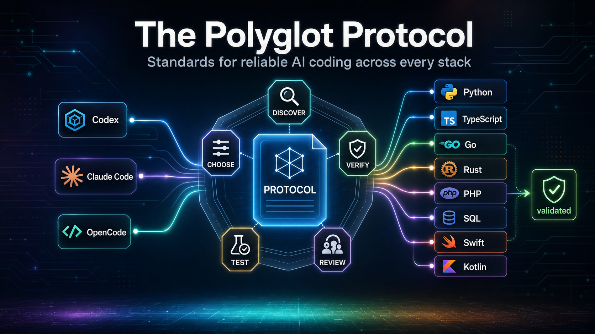

# The Polyglot Protocol



A senior-engineer protocol for polyglot code generation (codebases that span
multiple programming languages, frameworks, or runtimes), architecture,
testing, security, performance, and agent validation.

This project packages a portable skill for Codex, Claude Code, OpenCode, and
other skill-capable coding agents. It helps agents make disciplined coding
decisions across languages without inventing APIs, skipping repository
discovery, overengineering, or ignoring validation.

The Polyglot Protocol is a protocol, not a framework: it does not replace an
agent runtime, command system, planner, or orchestration layer. Instead, it
defines the engineering standards those systems should follow. Frameworks such
as OAC Framework and other agent-control systems can use it as a complementary
quality layer for language choice, repository discovery, dependency discipline,
testing, security, validation, and final review.

## The Problem

Most coding agents can write code quickly, but speed is not the same as
engineering judgment. In polyglot projects (projects that use multiple
programming languages, frameworks, or runtimes), agents often guess at APIs,
ignore repository conventions, choose the wrong language for the job, add
unnecessary dependencies, skip validation, or produce code that looks plausible
but fails under review.

Without explicit guardrails, LLMs and coding agents do a lot of guesswork. Some
models guess well enough to get by. Others burn tokens chasing dead ends:
invented package names, unsupported flags, stale API assumptions, mismatched
framework patterns, or fixes that solve the wrong problem.

That problem compounds across languages and tools. A useful agent has to know
when to preserve TypeScript patterns, when an operational script should be
Python, when SQL needs parameterized queries and rollback notes, when
platform-native code is required, and when a missing test, unsafe dependency, or
unsupported toolchain is a hard stop.

Without a protocol, every agent session becomes a one-off negotiation. You
spend time re-explaining standards, correcting invented behavior, tightening
vague plans, and asking for the validation the agent should have run already.

## The Solution

The Polyglot Protocol gives coding agents a portable senior-engineer operating
standard before they generate code.

It tells agents how to inspect the repository, preserve existing conventions,
choose the right language, verify current tooling, avoid invented APIs,
document risk, handle unsupported checks honestly, and validate the result
before calling work complete.

The result is not a new agent framework. It is the quality layer you can place
inside the tools and frameworks you already use: Codex, Claude Code, OpenCode,
OAC Framework, custom agent workflows, or team-specific automation.

Frameworks control the workflow. The Polyglot Protocol controls the engineering
bar.

## Why Use A Protocol?

| Without A Protocol | With The Polyglot Protocol |
|---|---|
| Agents guess at APIs and flags | Agents verify before relying on tools or APIs |
| Generic code ignores repository conventions | Code follows existing language, framework, and project patterns |
| Language and runtime choices drift | Language choice follows documented decision rules |
| Validation is skipped or vague | Validation is required, and unsupported checks are marked `N/A` with evidence |
| Dependencies get added casually | Dependencies require justification, version checks, and risk review |
| Every session needs the same standards explained again | Standards are portable and reusable across agents |

## How It Works

```text
Your coding request
↓
Repository discovery
↓
Language and framework decision rules
↓
Security, dependency, and validation guardrails
↓
Agent implementation
↓
Protocol audit and final verification
```

## Best Used With Agent Frameworks

The Polyglot Protocol does not replace frameworks such as OAC Framework,
OpenCode workflows, Claude Code plugins, or custom agent systems. It gives
those systems a stronger engineering standard to follow.

Use your framework for orchestration, commands, approvals, and agent routing.
Use The Polyglot Protocol for language choice, dependency discipline,
repository conventions, validation, security, and final review.

## Is This For You?

Use The Polyglot Protocol if you:

- Work across multiple languages, frameworks, or runtimes.
- Use coding agents for production code, not just prototypes.
- Want agents to stop guessing at APIs, dependencies, and project conventions.
- Need repeatable validation, security, testing, and review expectations.
- Already use Codex, Claude Code, OpenCode, OAC Framework, or custom agent
  workflows.

Skip it if you:

- Only want a fully autonomous agent framework.
- Do not care whether generated code follows existing repository conventions.
- Are experimenting with throwaway prototypes where validation does not matter.

## Try This Test

Ask your coding agent to modify a real project that uses more than one language
or framework. Then check:

- Did it inspect the repository before choosing an approach?
- Did it preserve existing conventions?
- Did it invent any APIs, flags, package names, or config keys?
- Did it justify new dependencies?
- Did it run the right validation?
- Did it explain unsupported checks honestly?

If you have to ask for these things manually, you need a protocol.

## What It Includes

- `SKILL.md`: skill entrypoint
- `docs/languages/`: individualized guidance for 22 languages
- `docs/languages/<language>/readme.md`: human-readable quality,
  completeness, and accuracy decisions for each language
- `docs/language-guidelines.md`: language selection and default-script policy
- `docs/workflow/dev-workflow.md`: planning, audit, validation, and `N/A` rules
- `scripts/validate-workspace.py`: full local validation
- `adapters/`: lightweight guidance and human-readable README files for Codex,
  Claude Code, and OpenCode

## Quick Start

Use the skill folder directly from an agent that supports local skill folders,
or copy the relevant adapter into the target agent's expected guidance location.

## One-Line Install

Codex:

```sh
git clone https://github.com/sabir-gbs/the-polyglot-protocol.git /tmp/the-polyglot-protocol && python /tmp/the-polyglot-protocol/scripts/install-skill.py --agent codex --force
```

Claude Code:

```sh
git clone https://github.com/sabir-gbs/the-polyglot-protocol.git /tmp/the-polyglot-protocol && python /tmp/the-polyglot-protocol/scripts/install-skill.py --agent claude-code --force
```

OpenCode:

```sh
git clone https://github.com/sabir-gbs/the-polyglot-protocol.git /tmp/the-polyglot-protocol && python /tmp/the-polyglot-protocol/scripts/install-skill.py --agent opencode --force
```

Custom location:

```sh
git clone https://github.com/sabir-gbs/the-polyglot-protocol.git /tmp/the-polyglot-protocol && python /tmp/the-polyglot-protocol/scripts/install-skill.py --target ~/path/to/skills/the-polyglot-protocol --force
```

Validate the project:

```sh
python scripts/validate-workspace.py
```

Expected result:

```text
language guidance validation: PASS
language files: 22
language readmes: 22
operational files: 11
score: 100/100
workspace validation: PASS
```

## Language Coverage

Bash, C, C#, C++, CSS, Dart, Go, HTML, Java, JavaScript, Kotlin, Lua, PHP,
Python, R, Ruby, Rust, Shopify Liquid, SQL, Swift, TypeScript, and Zig.

## Core Principles

- Preserve existing repository conventions.
- Default operational scripts to Python unless the project already has a better
  native script runner.
- Use platform-native languages for product surfaces.
- Prefer the shortest reliable supported path.
- Verify dependency, runtime, and API claims from local code or official docs.
- Treat unsupported checks as explicit `N/A` items with evidence.

## Human-Readable Decision Guides

Each language has a dedicated README folder, for example:

- `docs/languages/python/readme.md`
- `docs/languages/typescript/readme.md`
- `docs/languages/rust/readme.md`

These README files summarize the decisions that control codegen quality,
completeness, and accuracy. The full enforceable rules remain in the matching
top-level language file such as `docs/languages/python.md`.

Each coding environment adapter also has a README:

- `adapters/codex/readme.md`
- `adapters/claude-code/readme.md`
- `adapters/opencode/readme.md`

## Project Status

Current validation score: `100/100`.

See `docs/languages/score-report.md` for the score report and
`docs/languages/scoring-rubric.md` for the rubric.

## License

Copyright (C) 2026 Growth by Sabir Inc.

Licensed under the Apache License, Version 2.0 (`Apache-2.0`). Commercial and
non-commercial use are permitted under the license terms.
